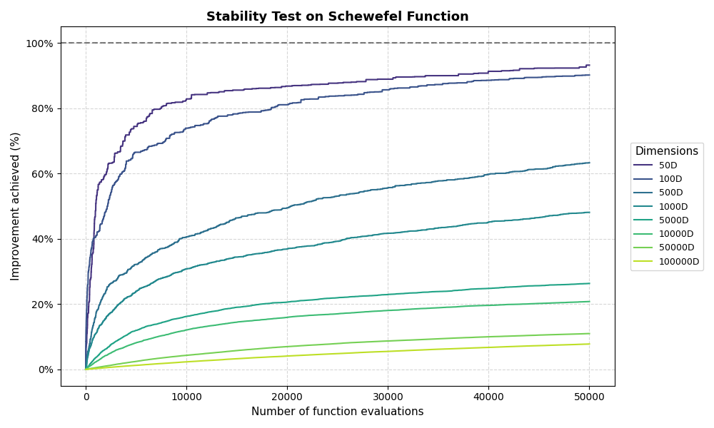
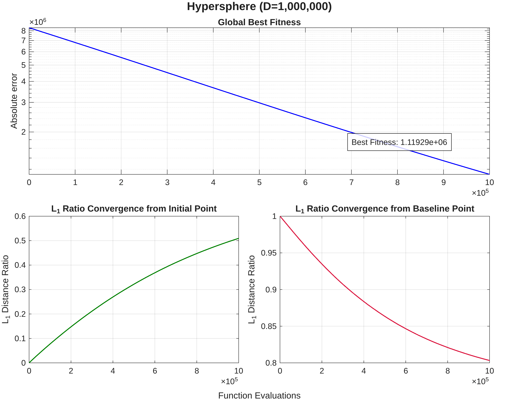
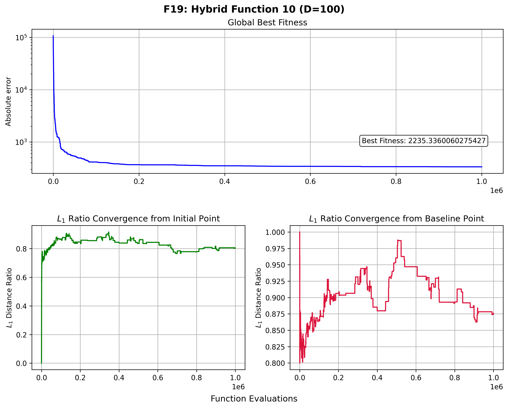

SGOLab
=========================

*Si lo deseas, puedes consultar la versión de este documento en inglés:* [English version](README.md)

SGOLab es un proyecto personal del programa de investigación *Towards Scalable Geometric Optimization,* que explora una reinterpretación geométrica de la optimización *black-box.* 

La hipótesis central del proyecto plantea que el proceso de optimización puede abordarse desde un espacio alternativo con menor dependencia del codominio, introduciendo una separación conceptual entre el dominio y la función objetivo. 

Bajo este enfoque, en lugar de modelar explícitamente la función, SGOLab explota la geometría del *dominio acotado* mediante la construcción de un sistema de referencia relativo que guía dinámicamente el proceso de búsqueda.

## Motivación

En términos generales, el Teorema No Free Lunch (NFL) establece que ningún algoritmo de optimización es universalmente superior a los demás y que, en ausencia de supuestos sobre la estructura del problema, todos presentan el mismo rendimiento promedio. La aparente superioridad de un método emerge únicamente cuando este logra explotar regularidades específicas de la función objetivo.

En el contexto de la optimización *black-box*, dichas regularidades no son accesibles *a priori* y deben inferirse a partir de los puntos evaluados. Este proceso se vuelve especialmente costoso en escenarios de alta dimensionalidad o cuando cada evaluación implica un gasto computacional significativo, limitando la eficiencia de los enfoques tradicionales.

Bajo estas condiciones, surge una pregunta fundamental:

> ¿Es posible guiar el proceso de búsqueda de forma eficiente sin reconstruir explícitamente el paisaje de la función?

A lo largo de la historia, tanto en matemáticas como en física, problemas complejos han sido abordados mediante su representación en espacios alternativos, donde ciertas estructuras se vuelven más accesibles, como ocurre con las transformadas de Fourier y Laplace.

Mientras que gran parte de los enfoques actuales se centran en aprender o aproximar la información del codominio para modelar el comportamiento de la función, SGOLab parte de una premisa distinta: *el dominio no es un espacio inerte, sino una fuente potencial de estructura*. En este contexto, la investigación no se centra en la reconstrucción del paisaje de la función, sino en la navegación inteligente del espacio mediante sistemas de referencia geométricos inducidos por las relaciones entre las muestras.

## Avances

> *"Dadme un punto de apoyo y moveré al mundo"* — Arquímedes

El sistema de referencia de SGOLab está diseñado para permitir la navegación en entornos *black-box* mediante una métrica interna independiente de la escala del problema. Su construcción se basa en la fijación de puntos de referencia y la definición de una unidad base de distancia, lo que permite:

- Delimitar regiones de búsqueda
- Estructurar desplazamientos
- Monitorear el progreso mediante medidas relativas

Este enfoque no busca resolver el problema original de forma directa, sino traducirlo a un entorno donde el análisis resulte analíticamente tratable y permita el uso de herramientas matemáticas más potentes.

### Validación experimental preliminar

Los siguientes resultados muestran el comportamiento de un algoritmo basado en una solución única operando en un entorno puramente exploratorio, demostrando que la navegación basada en la geometría del dominio permite una convergencia estable incluso sin una reconstrucción explícita del paisaje de la función.

#### Escalabilidad con presupuesto fijo de evaluaciones

Se presentan las curvas de convergencia para las funciones Hiperesfera y Schwefel bajo un presupuesto estricto de 50,000 evaluaciones. El análisis se centra en el porcentaje de mejora obtenido mediante un barrido dimensional; el interés principal radica en la estabilidad del patrón de convergencia, el cual mantiene un comportamiento análogo a medida que aumenta la escala del problema.

- Función unimodal: Hiperesfera

  

- Función multimodal: Schwefel

  

#### Dimensiones extremas

Se evalúa el rendimiento del algoritmo en escenarios de *Large Scale Global Optimization* (LSGO), utilizando las funciones Hiperesfera y Ackley en 100,000 dimensiones. Bajo un presupuesto de 1,000,000 de evaluaciones, se grafica el error absoluto respecto al óptimo conocido; para demostrar la robustez del modelo; la ejecución de estas pruebas en tales escalas permite validar la robustez del modelo en escenarios de complejidad extrema, poco documentados en la literatura técnica actual.
Asimismo, se introducen visualmente las medidas relativas de progreso, cuya fundamentación técnica se detalla en la sección posterior.

- Función Ackley (100,000 dimensiones)

  

- Función Hiperesfera (100,000 dimensiones)

  

- Función Hiperesfera (1,000,000 de dimensiones)

  

*Asimismo, se pueden consultar otros experimentos en el siguiente enlace:* [Benchmark Functions](results/preliminary-results/benchmark-functions).

#### Importancia de la medida relativa de progreso

Esta sección introduce métricas de navegación basadas en distancias relativas ($L_1$ Ratio) calculadas desde los puntos de apoyo hacia la mejor solución encontrada. Al analizar las funciones híbridas de la suite CEC 2017 (F18 y F19), se observa un contraste fundamental: mientras las curvas de error absoluto sugieren un estancamiento prematuro , las medidas relativas revelan una actividad intensa y una alta presencia de ruido durante el proceso.

A diferencia de las curvas obtenidas en dimensiones extremas (que presentan una transición más suave), aquí la oscilación es constante. Este fenómeno valida la naturaleza puramente exploratoria del prototipo actual; la fase de explotación, actualmente en desarrollo, tendrá como objetivo principal disminuir este ruido para estabilizar la convergencia en paisajes de alta complejidad topográfica.

- F18: Hybrid Function 9

  

- Hybrid Function 10

  

*Además, se pueden consultar resultados adicionales utilizando la suite de benchmarks **CEC 2017** en el siguiente enlace:* [CEC 2017 - Opfunu](results/preliminary-results/opfunu/cec2017).

## Dependencias

El desarrollo, las pruebas y ejecución de los experimentos de este proyecto se apoyan en las siguientes librerías y herramientas:

- [**Mealpy**](https://github.com/thieu1995/mealpy)
- [**Opfunu**](https://github.com/thieu1995/opfunu)
- [**Benchmark Functions - A Python Library**](https://gitlab.com/luca.baronti/python_benchmark_functions)

## Disponibilidad

Debido a que el modelo matemático se encuentra en proceso de documentación formal para su publicación en *whitepapers* y revistas académicas, el acceso al código de fuente está restringido temporalmente.

Si eres investigador, deseas conocer más sobre mi trabajo o buscas una colaboración técnica, puedes contactar a través del correo:
- **Contacto:** [misa.hdez97@proton.me](mailto:misa.hdez97@proton.me)

## Roadmap 

Proximamente...

