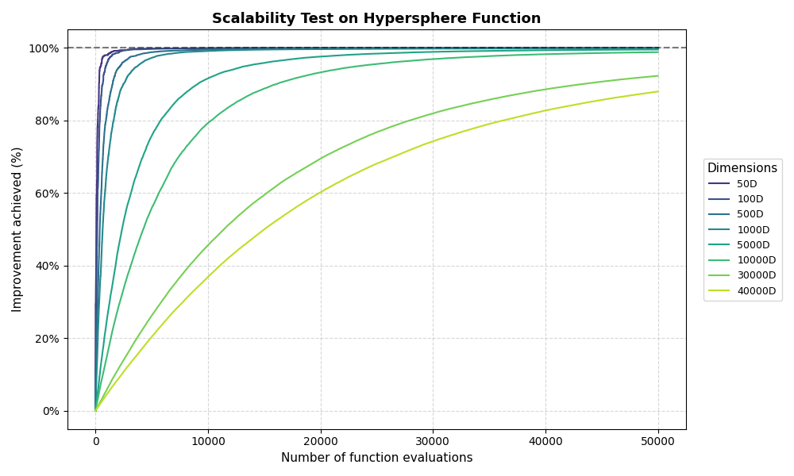
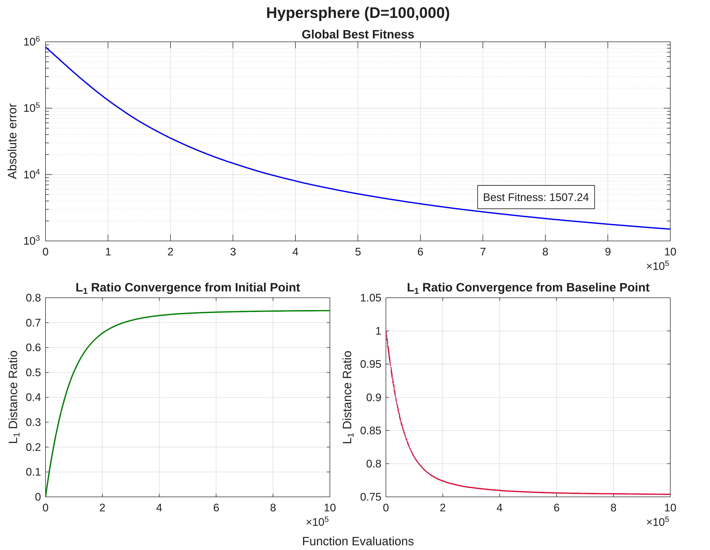
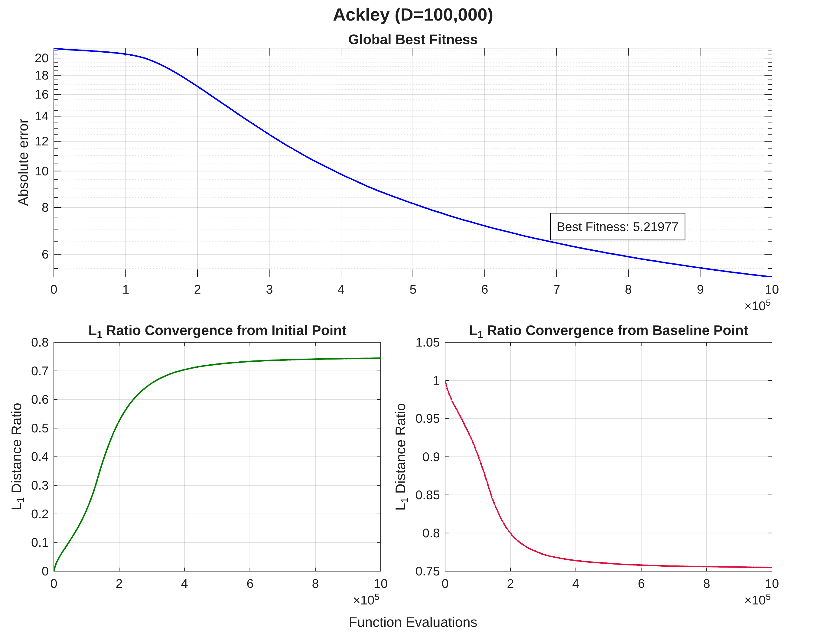
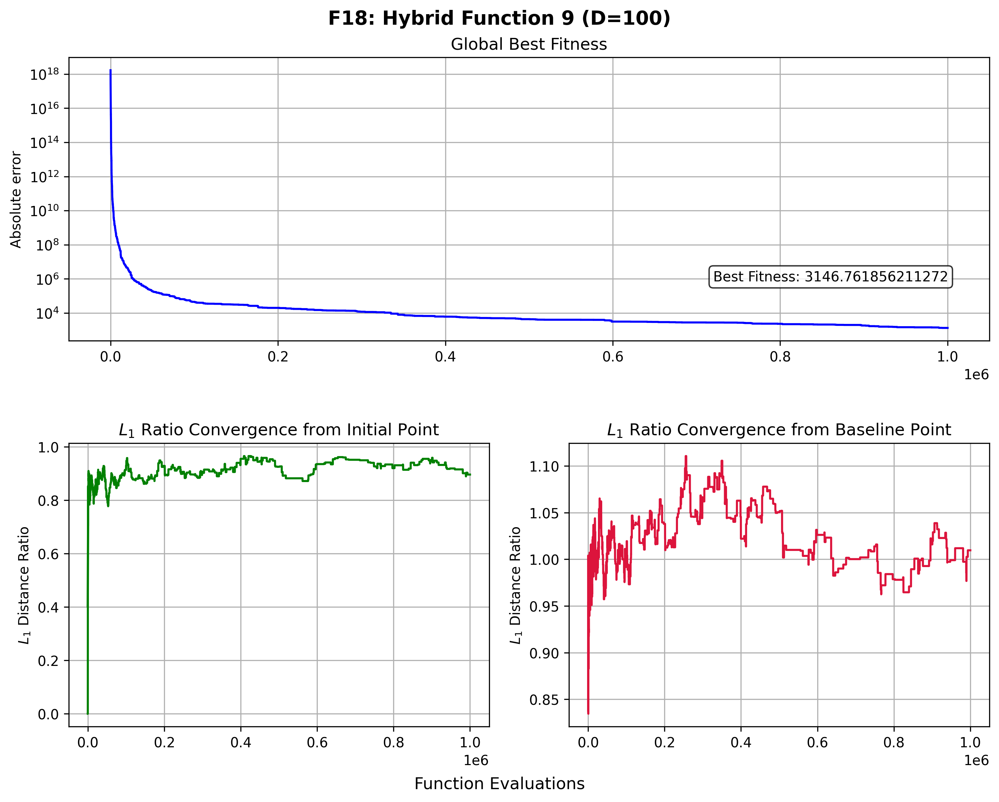

SGOLab
=========================

SGOLab es un proyecto personal del programa de investigación *Towards Scalable Geometric Optimization,* que explora una reinterpretación geométrica de la optimización *black-box.* 

La hipótesis central del proyecto plantea que el proceso de optimización puede abordarse desde un espacio alternativo con menor dependencia del codominio, introduciendo una separación conceptual entre el dominio y la función objetivo. 

Bajo este enfoque, en lugar de modelar explícitamente la función, SGOLab explota la geometría del *dominio acotado* mediante la construcción de un sistema de referencia relativo que guía dinámicamente el proceso de búsqueda.

## Motivación

> "Dadme un punto de apoyo y moveré al mundo"
>
> — Arquímedes

En términos generales, el Teorema No Free Lunch (NFL) establece que ningún algoritmo de optimización es universalmente superior a los demás y que, en ausencia de supuestos sobre la estructura del problema, todos presentan el mismo rendimiento promedio. La aparente superioridad de un método emerge únicamente cuando este logra explotar regularidades específicas de la función objetivo.

En el contexto de la optimización *black-box*, dichas regularidades no son accesibles *a priori* y deben inferirse a partir de los puntos evaluados. Este proceso se vuelve especialmente costoso en escenarios de alta dimensionalidad o cuando cada evaluación implica un gasto computacional significativo, limitando la eficiencia de los enfoques tradicionales.

Bajo estas condiciones, surge una pregunta fundamental:

> ¿Es posible guiar el proceso de búsqueda de forma eficiente sin reconstruir explícitamente el paisaje de la función?

A lo largo de la historia, tanto en matemáticas como en física, problemas complejos han sido abordados mediante su representación en espacios alternativos, donde ciertas estructuras se vuelven más accesibles, como ocurre con las transformadas de Fourier y Laplace.

Mientras que gran parte de los enfoques actuales se centran en aprender o aproximar la información del codominio para modelar el comportamiento de la función, SGOLab parte de una premisa distinta: el dominio no es un espacio inerte, sino una fuente potencial de estructura. En este contexto, la investigación no se centra en la reconstrucción del paisaje de la función, sino en la navegación inteligente del espacio mediante sistemas de referencia geométricos inducidos por las relaciones entre las muestras.

## Avances
El sistema de referencia de SGOLab está diseñado para permitir la navegación en entornos *black-box* mediante una métrica interna independiente de la escala del problema. Su construcción se basa en la fijación de puntos de apoyo y la definición de una unidad base de distancia, lo que permite:

- Delimitar regiones de búsqueda
- Estructurar desplazamientos
- Monitorear el progreso mediante medidas relativas

Este enfoque no busca resolver el problema original de forma directa, sino traducirlo a un entorno donde el análisis resulte analíticamente tratable y permita el uso de herramientas matemáticas más potentes.

### Validación experimental

#### Escalabilidad con presupuesto fijo de evaluaciones

| Función Unimodal                                                                                                    | Función Multimodal                                                                                          |
| ---------------------------------------------------------------------------------------------------------------------| -------------------------------------------------------------------------------------------------------------|
|  |  |

#### Dimensiones extremas

| Hypersphere                                                                                                                                 | Ackley                                                                                                                       |
| ---------------------------------------------------------------------------------------------------------------------------------------------| ------------------------------------------------------------------------------------------------------------------------------|
|  |  |

#### Importancia de la medida relativa de progreso

## Dependencias

El desarrollo, las pruebas y ejecución de los experimentos de este proyecto se apoyan en las siguientes librerías y herramientas:

- [**Mealpy**](https://github.com/thieu1995/mealpy)
- [**Opfunu**](https://github.com/thieu1995/opfunu)
- [**Benchmark Functions - A Python Library**](https://gitlab.com/luca.baronti/python_benchmark_functions)

## Disponibilidad

Debido a que el modelo matemático se encuentra en proceso de documentación formal para su publicación en *whitepapers* y revistas académicas, el acceso al código de fuente está restringido temporalmente.

Si eres investigador, deseas conocer más sobre mi trabajo o buscas una colaboración técnica, puedes contactar a través del correo:
- **Contacto:** [misa.hdez97@proton.me](mailto:misa.hdez97@proton.me)

## Pendientes 

- [ ] Finalizar la redacción del *whitepaper* y los artículos académicos correspondientes
- [ ] Preparar el código base para futuras liberaciones públicas una vez se alcance la validación académica formal

